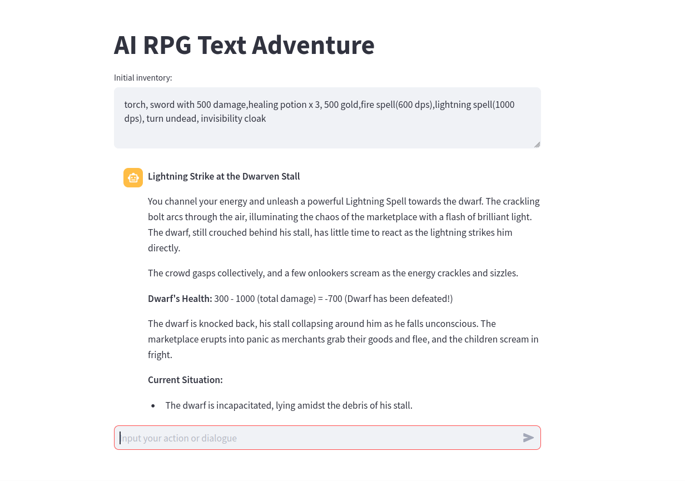

# AI RPG Text Adventure

This project is a text-based RPG adventure game driven by an AI Dungeon Master (DM). The DM generates a solo RPG adventure inspired from Dungeons & Dragons (DnD) rules, but with simplified mechanics. The player interacts with the game by typing commands, and the AI responds by advancing the story.

## Features

- AI-driven Dungeon Master to generate and control the game world. Uses the latest gpt-4o-mini for fast response
- Conversational Memory support to maintain conversation context throughout the game session.
- Simplified DnD mechanics for ease of play.
- Easy to use Web UI created using Streamlit
- Modify initial inventory, starting scenarios etc using prompts
- Configureable prompt templates to modify pre-defined game mechanics using text
- Save to and load game session using JSON

## Planned features
 - Better object-oriented control of game mechanics
 - Support for other LLMs

## Installation

1. **Clone the repository:**
   ```bash
   git clone https://github.com/yourusername/ai-rpg-text-adventure.git
   cd ai-rpg-text-adventure

2. **Create a virtual environment:**
    ```bash
    python -m venv .venv
    source .venv/bin/activate
    ```
3. **Install the dependencies:**
    ```bash
    pip install -r requirements.txt
    ```
4. **Set up environment variables:**
    ```bash
    export OPENAI_API_KEY="<your-openai-key>"
    ```
## Usage
Run the game by executing the main script via streamlit:

```bash
streamlit run ai-rpg-text.py
```

